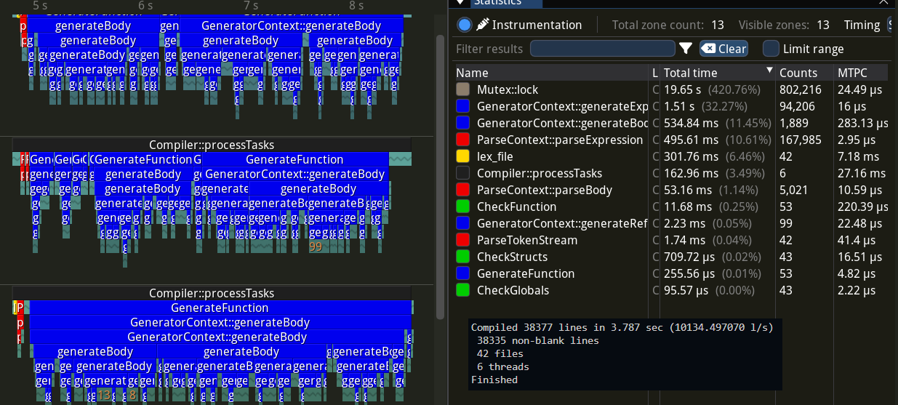
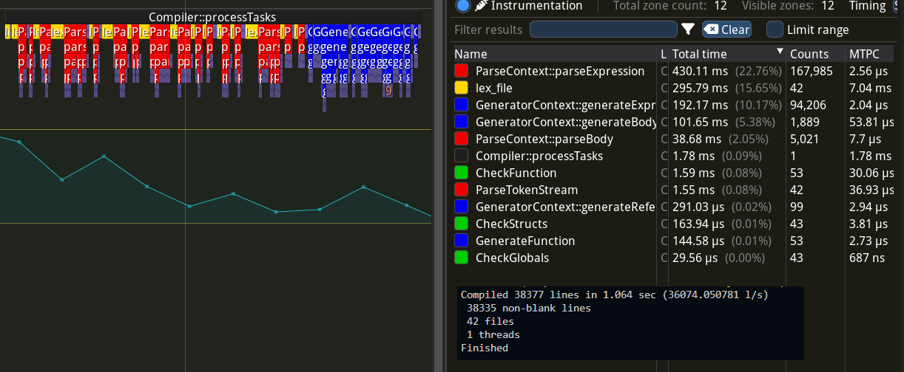
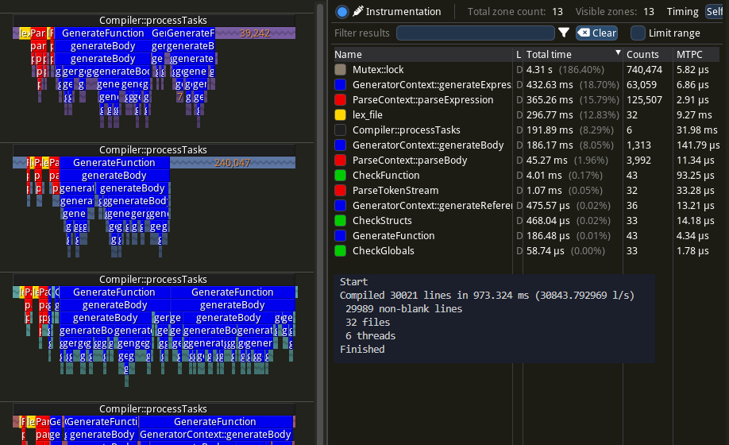
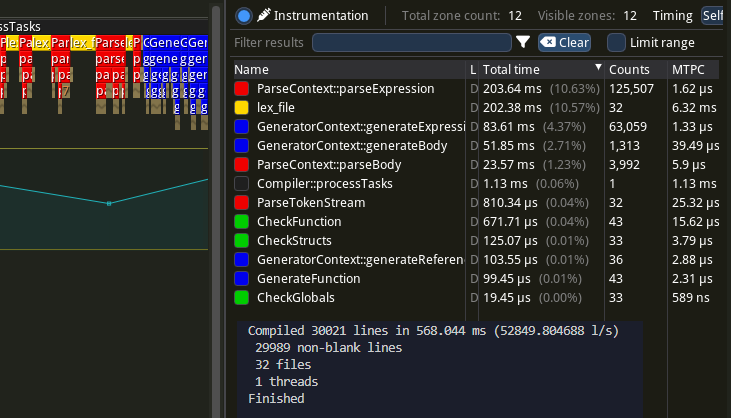

A compiler with a simple language called **Tin**.

# Performance
During all tests, as few programs are running on the computer as possible. No browsers, only Tracy Profiler and a text editor.

Tested with `AMD Ryzen 7 4800H i7-4790K CPU, 2.9 GHz (base), 8/16 cores` (laptop from 2021)

(the laptop runs faster when power is connected, all tests using this laptop was run when the laptop was connected for consistency)

Tested with `i7-4790K CPU, 4.00 GHz, 4/8 cores` (old computer from 2013-2014)

# How to build (Windows only)
## Visual Studio C++ tools
Download Visual Studio installer and make sure you have "Desktop development with C++".
Then press the Windows button and search for "developer" and start "Developer Command Prompt VS2022" (you may have VS2019 depending on your version).
Now you will have `cl` and `link` available.

You can type `code` into the terminal if you are using Visual Studio Code.
Otherwise, use `cd path_to_local_repo` to get to your local copy of this repository.

Finally, you should be able to start `build.bat` in the terminal.

## GNU (g++)
If you have g++ (mingw-64) then you can run `make` to compile the project.

Note that we have not managed to use Tracy Profiler with g++.

# Further work
From tracy, a million line program locks mutexes 34 000 times which takes 5.35 seconds. 5.35 s / 16 threads is 334 ms which is half of the compile time from start to finish which is 624 ms. If we can reduce locks further than we should achieve even better results.